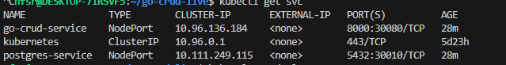
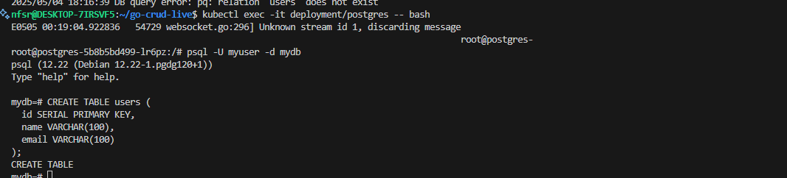
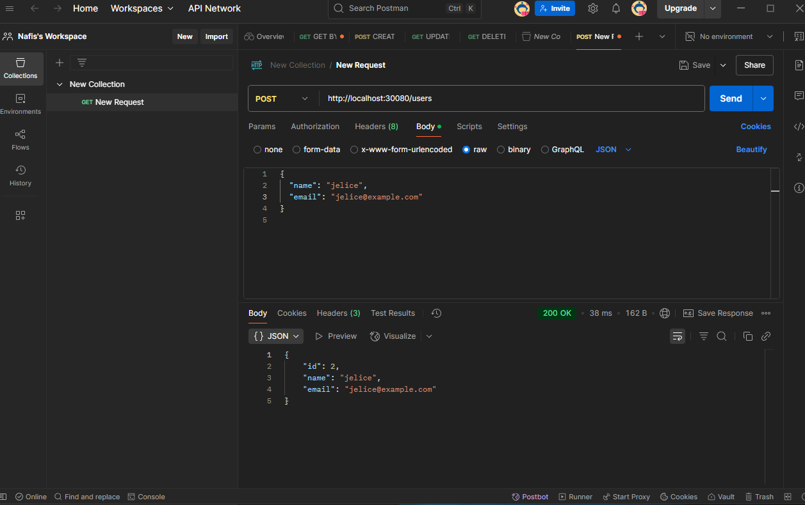
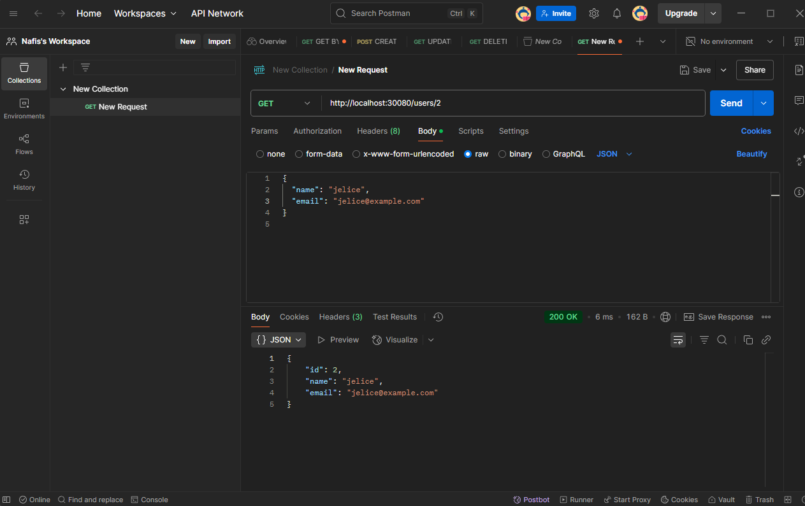
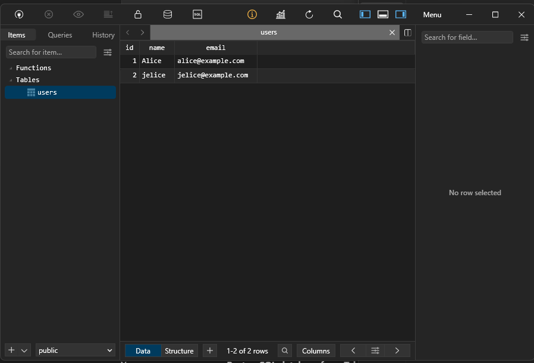

## 🚀 Go CRUD App
A secure, lightweight, and containerized CRUD application built with Go and uses postgres as DB — equipped with CI/CD pipelines, Docker secrets, and GitHub Actions for smooth development and deployment.
## 📁 Project Structure

```
GO-CRUD/
├── .github/               # GitHub workflows for CI/CD
├── .env                   # Environment variables (local use)
|── Screenshots            # Screenshots
|── user-api               # HELM Charts
├── .gitignore             # Git ignored files
├── docker-compose.yml     # Multi-service orchestration
├── Dockerfile             # Image build configuration
├── go.mod                 # Go module file
├── go.sum                 # Go dependency checksums
├── main.go                # Main application entry point
|── readme.MD              # Project documentation
|── deployall.yaml         # K8s yaml file

```

## 🔧 Configuration
Use .env for local development:
Changed the hardcoded `DB_USER` & `DB_PASSWORD` so far we can pass the from `.env` or from `terminal`.


## 🛠️ CI/CD Pipelines (GitHub Actions)

✅ Lint Check

Ensures code adheres to Go best practices.

🔍 Docker Security & Vulnerability Scan Using Trivy

```
Report Summary
┌────────────────────────────┬──────────┬─────────────────┬─────────┐
│           Target           │   Type   │ Vulnerabilities │ Secrets │
├────────────────────────────┼──────────┼─────────────────┼─────────┤
│ test-image (alpine 3.21.3) │  alpine  │        0        │    -    │
│ app/api                    │ gobinary │        0        │    -    │
└────────────────────────────┴──────────┴─────────────────┴─────────┘
```


🚀 Release Pipeline
Automatically builds and tags Docker images from GitHub releases.

Uses tag-based versioning like:
```
IMAGE_TAG=${GITHUB_REF#refs/tags/}
```
## Deploy On kubernetes

This project is deployed on a Kubernetes cluster. The DB_URL was updated for Kubernetes deployment, and NodePort was used to expose the application for testing.


Apply the Kubernetes services with the following command:
```
kubectl apply -f deployall.yaml
```

Access the PostgreSQL pod and create a test table:
```
kubectl exec -it deployment/postgres -- bash
```
After accessing the pod, create a table for testing:
```
psql -U myuser -d mydb
CREATE TABLE users (id SERIAL PRIMARY KEY, name VARCHAR(100), email VARCHAR(100));
```


After deploying, test the application’s CRUD operations using Postman. Use the following URL to test:
```
http://localhost:30080/users  # 30080 is the NodePort
```




You can also use TablePlus to visually inspect the data in the PostgreSQL table:



# Deployment with Helm Chart

This Helm chart defines the deployment of a PostgreSQL database using Kubernetes resources. Below is a summary of the key configurations:

## Deployment Overview
- **Deployment Name**: `postgres`
- **Replica Count**: 1 (single instance of PostgreSQL)
- **Container Image**: Configured dynamically using the Helm values file (`{{ .Values.postgres.image }}`).
- **Environment Variables**: Loaded from a Kubernetes Secret named `postgres-credentials`.
- **Port Configuration**: Exposes PostgreSQL on container port `5432`.
- **Persistent Storage**:
  - A Persistent Volume Claim (PVC) named `postgres-pvc` is used to store PostgreSQL data.
  - The data is mounted to the container at `/var/lib/postgresql/data`.
- **Helm installation**
```
helm install user-api ./user-api \
  --set postgres.credentials.user=  \
  --set postgres.credentials.password=  \
  --set postgres.credentials.db=
  ```

## Helm Chart Benefits
- **Dynamic Configuration**: The use of Helm templates allows for easy customization of the PostgreSQL image and other parameters.
- **Secure Secrets Management**: Sensitive credentials are managed securely using Kubernetes Secrets.
- **Persistent Data**: Ensures data durability with a Persistent Volume Claim.

This setup provides a scalable and configurable way to deploy PostgreSQL in a Kubernetes environment.